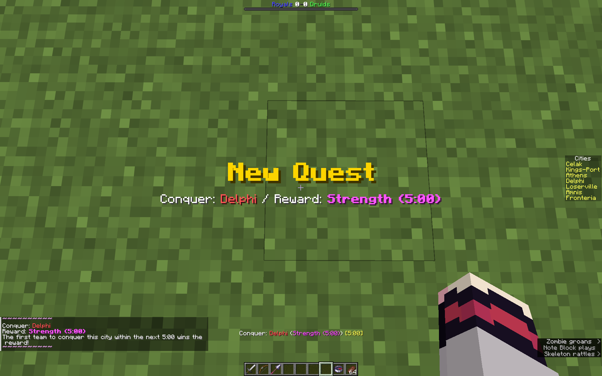
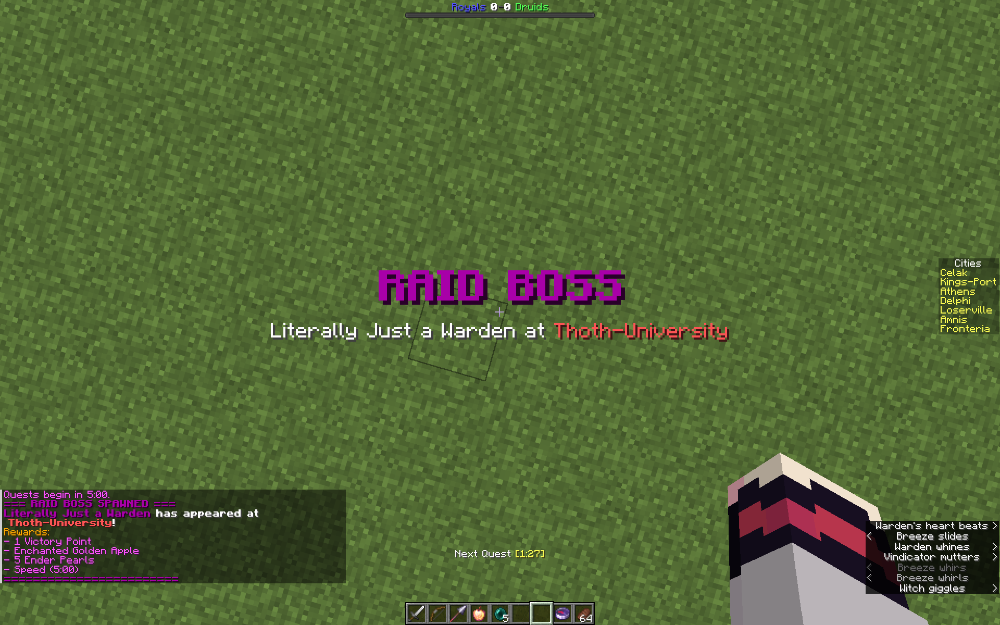

# Mythcraft Wars

A Minecraft datapack for team-based PvP conquest. Two teams compete across 7 cities and 4 skill locations through timed quests, city conquest, and dual progression systems. Capture cities for victory points, hold skill locations to power up your team, and level your character through combat.

**Pack format:** 94 (Minecraft 1.21.11)

## Player Menu

Sneak + right-click with the compass to open the player menu. From here you can view game state, select your class, teleport to locations, and review quest history.

## Classes

There are three classes. As you kill mobs and enemy players, you increase your character level, improving your class gear and abilities. Switch anytime with the compass menu to be instantly re-equipped.

### Warrior (Default)

The balanced frontline fighter. Uses sword, bow, and spear to lunge around the battlefield.

| Slot | Item |
|------|------|
| 1 | Sword |
| 2 | Bow |
| 3 | Spear (+scaling Lunge) |
| Offhand | — |

**Armor:** 

| Level | Armor | Toughness |
|-------|-------|-----------|
| 1 | 10 | 0 |
| 2 | 12 | 1 |
| 3 | 14 | 2 |
| 4 | 16 | 3 |
| 5 | 18 | 4 |

### Assassin

Lower defenses, but gets a quick draw crossbow and a totem of undying that can be charged by killing troops and enemy players.

| Slot | Item |
|------|------|
| 1 | Sword |
| 2 | Bow |
| 3 | Crossbow (+scaling Quick Draw) |
| Offhand | Chargeable Totem of Undying (number charges needed to fill decreases with level) |

**Armor:**

| Level | Armor | Toughness |
|-------|-------|-----------|
| 1 | 6 | 0 |
| 2 | 7 | 0 |
| 3 | 9 | 1 |
| 4 | 11 | 2 |
| 5 | 13 | 3 |

**Chargeable Totem** — Charge by killing (+1 troop, +3 player). Charges needed to fill decreases as you level (64/48/36/24/16). When fully charged, the totem saves you from death with regeneration, absorption, speed, invisibility, and resistance. At 25%+ charge, right-click to activate: grants Speed II to nearby allies and 15 seconds of invisibility to yourself.

### Bastion

The heavy tank with two unique abilities. Highest armor and toughness, with a shield for blocking.

| Slot | Item |
|------|------|
| 1 | Axe |
| 2 | Crossbow (mortar use) |
| 3 | Mace (+scaling Density) |
| Offhand | Shield |

**Armor:**

| Level | Armor | Toughness |
|-------|-------|-----------|
| 1 | 14 | 1 |
| 2 | 16 | 2 |
| 3 | 17 | 4 |
| 4 | 18 | 6 |
| 5 | 20 | 8 |

**Perfect Parry** — Raise your shield and block an attack within 0.5 seconds for a Perfect Parry, dealing damage and Slowness II to the attacker plus Resistance I to yourself. A Perfect Parry also prevents your shield from being disabled by heavy attacks (axes, wardens, etc.). Blocking outside the window still triggers a lesser Normal Parry. Damage scales with character level (3-5 hearts perfect, 1.5-2.5 hearts normal). 2.5 second cooldown.

**Mortar Shot** — Load your crossbow while sneaking to fire a team-colored firework mortar. On impact, leaves a 10-second Jump Boost field for allies. Explosion count and field strength scale with character level. 10 second cooldown.

## Progression

### Character Levels (Per-Player, 1-5)

Earned through combat XP (+1 per troop kill, +3 per player kill). Affects weapon tier (Iron, Diamond, Netherite), armor/toughness attributes, and class specific scaling enchantments and abilities. 

### Team Skills (Shared, 0-5)

Earned by your team grinding for XP at the four skill locations. Enchantments apply to all team members.

#### Attack

| Level | Effects |
|-------|---------|
| 1-5 | Sword/Axe/Spear: Sharpness I-V, Bow: Power I-V |
| 3+ | Sword: Sweeping Edge III |

#### Defense

| Level | Effects |
|-------|---------|
| 1-5 | All Armor: Protection I-V |
| 3+ | All Armor: Thorns III |

#### Magic

| Level | Effects |
|-------|---------|
| 1+ | Fireball spell unlocked |
| 3+ | Sword: Knockback II |

The Fireball spell scales with Magic level:

| Tier | Cooldown | Damage | Radius | Fire |
|------|----------|--------|--------|------|
| I | 30s | 6 | 3.0 | 5s |
| II | 25s | 8 | 3.5 | 7s |
| III | 20s | 10 | 4.0 | 9s |
| IV | 15s | 12 | 4.5 | 11s |
| V | 10s | 14 | 5.0 | 13s |

#### Special

| Level | Effects |
|-------|---------|
| 1+ | Boots: Frost Walker II |
| 2+ | Leggings: Swift Sneak III |
| 3+ | Bow: Infinity, Crossbow: Multishot |
| 4+ | Bow: Flame, Crossbow: Piercing IV |
| 5 | Sword: Fire Aspect II, Mace: Wind Burst III |

## Gameplay Systems

### Cities

Capture cities to gain benefits such as extra kit items or buffs. At the end of the game, controlled cities grant your side victory points.

### Skill Locations

4 Locations (Attack, Defense, Magic, Special) with a steady supply of troops to defeat for skill XP.

### Quests

Throughout the game, quests appear with various objectives and grant victory points or other rewards.

### Raid Bosses

Once during the game, a special Raid Boss will spawn at a random location and persist indefinitely. It grants extra XP and various rewards when defeated.

